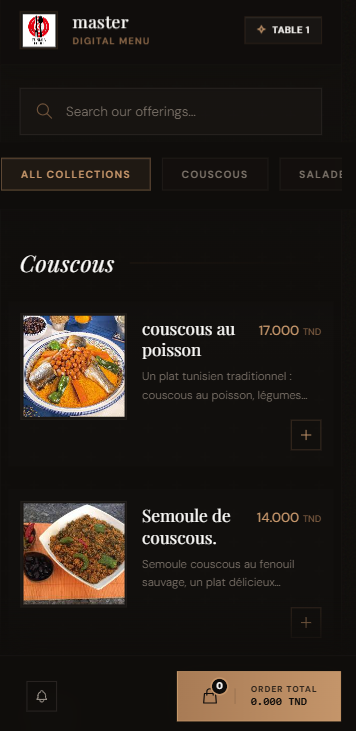
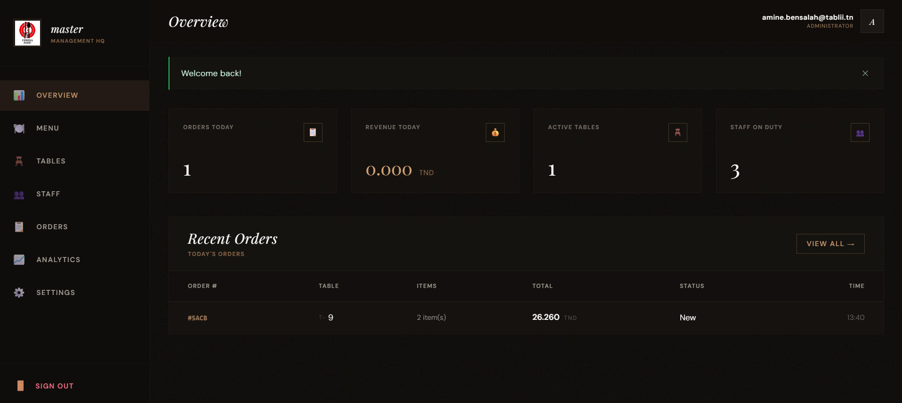

# 🍽️ Tablii

> **Multi-tenant restaurant ordering & management platform.**  
> QR-code menus, real-time kitchen display, staff management, analytics, and online payments — all in one.

[](https://python.org)
[](https://flask.palletsprojects.com)
[](./LICENSE)

---

## ✨ Features

- **QR-code menus** — customers scan a table QR code and order directly from their phone, no app needed
- **Real-time orders** — cashier, kitchen, and waiters are notified instantly via WebSocket
- **Multi-role staff** — cashier, kitchen, and waiter interfaces with role-based access
- **Multi-tenant** — each restaurant is fully isolated with its own data, staff, and settings
- **Multilingual menu** — French, Arabic, and English support for every item
- **Analytics dashboard** — daily stats, revenue trends, popular items, and peak-hour heatmaps
- **Online payments** — Flouci (Tunisian payment gateway) integration
- **Ramadan mode** — automatically shows Iftar/Suhoor categories at the right times
- **PWA support** — installable on mobile, works offline via Service Worker
- **Admin panel** — super-admin view for managing all restaurants and subscriptions

---

## 📸 Platform Previews

<div align="center">
  <table>
    <tr>
      <td align="center" width="50%">
        <b>Customer Interface</b><br><br>
        
      </td>
      <td align="center" width="50%">
        <b>Owner Analytics Dashboard</b><br><br>
        
      </td>
    </tr>
  </table>
</div>

---

## 🚀 Quick Start (Local Development - Windows Only)

Use **PowerShell** on Windows. Do everything from the project root folder.

### 1. Clone the repo and enter the project

```powershell
git clone https://github.com/0xyo/Tablii.git
cd Tablii
```

If your folder is named `restaurant` instead of `Tablii`, use:

```powershell
cd C:\Users\YOUR_NAME\Desktop\restaurant
```

### 2. Create and activate the virtual environment

```powershell
python -m venv .venv
.\.venv\Scripts\Activate.ps1
```

If PowerShell blocks activation, run this once in the same PowerShell window:

```powershell
Set-ExecutionPolicy -Scope Process -ExecutionPolicy Bypass
.\.venv\Scripts\Activate.ps1
```

### 3. Install Python packages

```powershell
pip install -r requirements.txt
```

### 4. Install Node packages

```powershell
npm install
```

### 5. Create the local `.env` file

```powershell
Copy-Item .env.example .env
```

Make sure `.env` contains at least:

```env
FLASK_ENV=development
DATABASE_URL=sqlite:///dev.db
SECRET_KEY=dev-secret
SOCKETIO_CORS_ORIGINS=*
```

### 6. Build the CSS

```powershell
npm run build:css
```

### 7. Create/update the database

```powershell
flask db upgrade
```

### 8. Seed demo accounts

```powershell
python seed.py
```

Demo logins:

- Super admin: `superadmin@tablii.com` / `admin1234`
- Owner: `owner@tablii.com` / `owner1234`
- Staff restaurant slug: `chez-ahmed`
- Staff users: `caisse1`, `serveur1`, `cuisine1` / `staff1234`

### 9. Run the app

```powershell
python run.py
```

Open: **http://127.0.0.1:5000**

### Common mistakes

- Do **not** run the app from the old nested `tablii` folder.
- Run commands from the project root, the folder that contains `run.py`.
- If `python run.py` says it cannot find the file, you are in the wrong folder.
- If login always fails, run `python seed.py` again.
- The local SQLite file should be created at `instance\dev.db`.

---

## ⚙️ Environment Variables

| Variable | Description | Default |
|----------|-------------|---------|
| `SECRET_KEY` | Flask session secret key | `dev-fallback-change-me` |
| `DATABASE_URL` | Database connection URI | `sqlite:///dev.db` |
| `FLASK_ENV` | Environment (`development` / `production`) | `development` |
| `FLOUCI_APP_TOKEN` | Flouci payment token | — |
| `FLOUCI_APP_SECRET` | Flouci payment secret | — |
| `MAX_CONTENT_LENGTH` | Max upload size in bytes | `5242880` (5 MB) |

Create an `.env.example` file at the root with the keys above and empty values so new contributors know what to fill in.

---

## 🛠️ Tech Stack

| Layer | Technology | Version |
|-------|-----------|---------|
| Language | Python | 3.11 |
| Web framework | Flask | 3.1.3 |
| ORM | SQLAlchemy | 2.0.46 |
| Migrations | Flask-Migrate / Alembic | 4.1.0 / 1.18.4 |
| Authentication | Flask-Login | 0.6.3 |
| Forms / CSRF | Flask-WTF | 1.2.2 |
| Real-time | Flask-SocketIO + eventlet | 5.6.0 / 0.40.4 |
| Templating | Jinja2 (via Flask) | — |
| CSS | Tailwind CSS | 3.4 |
| Image processing | Pillow | 12.1.1 |
| QR codes | qrcode | 8.2 |
| Application server | Gunicorn | 25.1.0 |
| Database (dev) | SQLite | — |
| Database (production) | PostgreSQL | — |
| Payments | Flouci | — |
| Hosting | Render.com | — |

---

## 📦 Deployment

See the full step-by-step guide: **[docs/DEPLOYMENT.md](./docs/DEPLOYMENT.md)**

### Quick deploy to Render.com

1. Push this repository to GitHub.
2. Go to [Render dashboard](https://dashboard.render.com) → **New → Blueprint**.
3. Select your repository — Render auto-detects `render.yaml`.
4. Add your Flouci credentials in the **Environment** tab.
5. Click **Deploy**.

---

## 📚 Documentation

| Document | Description |
|----------|-------------|
| [docs/BACKEND.md](./docs/BACKEND.md) | Backend architecture, models, services, auth, subscriptions, and operations |
| [docs/BACKEND_WORKFLOW.md](./docs/BACKEND_WORKFLOW.md) | Step-by-step backend workflow and logic with "why use this?" reasoning |
| [docs/ALGORITHMS_AND_LIBRARIES.md](./docs/ALGORITHMS_AND_LIBRARIES.md) | Backend algorithms, libraries, and why each one is used |
| [docs/FRONTEND_REPORT.md](./docs/FRONTEND_REPORT.md) | Complete frontend report covering templates, styling, JS, realtime UI, and PWA behavior |
| [docs/API.md](./docs/API.md) | JSON API, customer endpoints, staff routes, admin routes, and Socket.IO events |
| [docs/er_diagram.md](./docs/er_diagram.md) | Entity relationship notes and database diagram reference |
| [docs/database.dbml](./docs/database.dbml) | DBML database schema source |

---

## 🧪 Running Tests

```bash
# Run the full test suite
pytest tests/

# Run with coverage report
pytest tests/ --cov=app --cov-report=term-missing

# Lint the codebase
flake8 app/ --max-line-length=100
# or
ruff check app/
```

---

## 🤝 Contributing

Contributions are welcome! Here's how to get started:

1. **Fork** the repository and create a new branch from `main`:
   ```bash
   git checkout -b feature/your-feature-name
   ```
2. **Make your changes** following the existing code style and conventions.
3. **Write tests** for any new functionality.
4. **Run the test suite** to make sure nothing is broken:
   ```bash
   pytest tests/
   ```
5. **Open a Pull Request** with a clear description of your changes.

### Code Style

- Python: **PEP 8** — use `flake8` or `ruff` to check
- Commits: descriptive messages in the imperative style (`Add feature X`, `Fix bug Y`)
- All new models must have a class-level docstring

---

## 📄 License

This project is licensed under the **MIT License** — see the [LICENSE](./LICENSE) file for details.

```
MIT License

Copyright (c) 2026 Tablii Contributors

Permission is hereby granted, free of charge, to any person obtaining a copy
of this software and associated documentation files (the "Software"), to deal
in the Software without restriction, including without limitation the rights
to use, copy, modify, merge, publish, distribute, sublicense, and/or sell
copies of the Software, and to permit persons to whom the Software is
furnished to do so, subject to the following conditions:

The above copyright notice and this permission notice shall be included in all
copies or substantial portions of the Software.

THE SOFTWARE IS PROVIDED "AS IS", WITHOUT WARRANTY OF ANY KIND, EXPRESS OR
IMPLIED, INCLUDING BUT NOT LIMITED TO THE WARRANTIES OF MERCHANTABILITY,
FITNESS FOR A PARTICULAR PURPOSE AND NONINFRINGEMENT. IN NO EVENT SHALL THE
AUTHORS OR COPYRIGHT HOLDERS BE LIABLE FOR ANY CLAIM, DAMAGES OR OTHER
LIABILITY, WHETHER IN AN ACTION OF CONTRACT, TORT OR OTHERWISE, ARISING FROM,
OUT OF OR IN CONNECTION WITH THE SOFTWARE OR THE USE OR OTHER DEALINGS IN THE
SOFTWARE.
```
