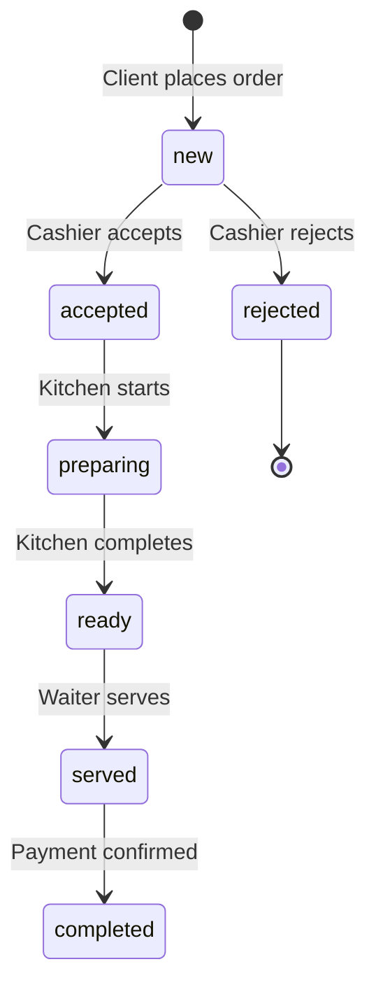
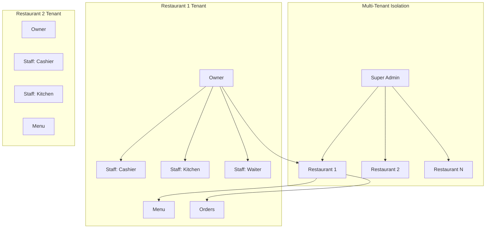

# Tablii Entity-Relationship Diagram

## Architecture Overview

```mermaid
erDiagram
    USERS ||--o{ RESTAURANTS : owns
    USERS {
        int id PK
        string email UK
        string password_hash
        string name
        string phone
        string role
        bool is_active
        timestamp created_at
    }

    RESTAURANTS ||--o{ STAFF_USERS : employs
    RESTAURANTS ||--o{ CATEGORIES : has
    RESTAURANTS ||--o{ MENU_ITEMS : has
    RESTAURANTS ||--o{ TABLES : has
    RESTAURANTS ||--o{ TABLE_SESSIONS : has
    RESTAURANTS ||--o{ ORDERS : has
    RESTAURANTS ||--o{ WAITER_CALLS : has
    RESTAURANTS ||--o{ REVIEWS : has
    RESTAURANTS ||--o{ LOYALTY_POINTS : tracks
    RESTAURANTS ||--o{ NOTIFICATIONS : sends
    RESTAURANTS ||--o{ SUBSCRIPTIONS : has
    RESTAURANTS ||--o{ OPERATING_HOURS : schedules
    RESTAURANTS {
        int id PK
        int owner_id FK
        string name
        string slug UK
        string description
        string logo_url
        string cover_url
        string address
        string phone
        string city
        string currency
        float tax_rate
        float service_charge
        bool auto_accept
        bool online_payment
        string default_language
        bool ramadan_mode
        bool loyalty_enabled
        bool is_active
        bool is_open
        timestamp created_at
    }

    SUBSCRIPTIONS {
        int id PK
        int restaurant_id FK UK
        string plan
        int max_tables
        int max_items
        timestamp started_at
        timestamp expires_at
        bool is_active
    }

    OPERATING_HOURS {
        int id PK
        int restaurant_id FK
        int day_of_week
        time open_time
        time close_time
        bool is_closed
    }

    STAFF_USERS {
        int id PK
        int restaurant_id FK
        string username
        string password_hash
        string name
        string role
        bool is_active
        timestamp created_at
    }

    CATEGORIES ||--o{ MENU_ITEMS : contains
    CATEGORIES {
        int id PK
        int restaurant_id FK
        string name_ar
        string name_fr
        string name_en
        string icon
        string icon_url
        int sort_order
        bool is_active
        time available_from
        time available_until
        string ramadan_type
    }

    MENU_ITEMS ||--o{ CUSTOMIZATIONS : has
    MENU_ITEMS ||--o{ ORDER_ITEMS : in
    MENU_ITEMS {
        int id PK
        int category_id FK
        int restaurant_id FK
        string name_ar
        string name_fr
        string name_en
        string description_ar
        string description_fr
        string description_en
        float price
        string image_url
        bool is_available
        int sort_order
        int prep_time
        int calories
        string allergens
        bool is_popular
        timestamp deleted_at
    }

    CUSTOMIZATIONS ||--o{ CUSTOM_OPTIONS : has
    CUSTOMIZATIONS {
        int id PK
        int menu_item_id FK
        string group_name_ar
        string group_name_fr
        string group_name_en
        string selection_type
        bool is_required
        int max_selections
    }

    CUSTOM_OPTIONS {
        int id PK
        int customization_id FK
        string name_ar
        string name_fr
        string name_en
        float extra_price
        bool is_default
    }

    TABLES ||--o{ TABLE_SESSIONS : active
    TABLES ||--o{ ORDERS : at
    TABLES ||--o{ WAITER_CALLS : from
    TABLES {
        int id PK
        int restaurant_id FK
        int table_number
        int capacity
        string status
        string qr_code_url
        float position_x
        float position_y
        int assigned_waiter_id FK
    }

    CUSTOMERS ||--o{ TABLE_SESSIONS : in
    CUSTOMERS ||--o{ ORDERS : places
    CUSTOMERS ||--o{ LOYALTY_POINTS : earns
    CUSTOMERS {
        int id PK
        string phone UK
        string name
        string email
        string password_hash
        timestamp created_at
    }

    TABLE_SESSIONS ||--o{ ORDERS : creates
    TABLE_SESSIONS {
        int id PK
        int table_id FK
        int restaurant_id FK
        int customer_id FK
        string session_token UK
        string guest_name
        timestamp started_at
        timestamp ended_at
        bool is_active
    }

    ORDERS ||--o{ ORDER_ITEMS : contains
    ORDERS ||--o{ PAYMENT_TRANSACTIONS : has
    ORDERS ||--o{ REVIEWS : has
    ORDERS {
        int id PK
        int session_id FK
        int restaurant_id FK
        int table_id FK
        int customer_id FK
        string order_number
        string status
        string payment_method
        string payment_status
        float subtotal
        float tax_amount
        float service_charge_amount
        float total_amount
        text special_notes
        bool is_gift
        int gift_from_table
        string gift_message
        timestamp created_at
        timestamp accepted_at
        timestamp preparing_at
        timestamp ready_at
        timestamp served_at
        timestamp completed_at
    }

    ORDER_ITEMS {
        int id PK
        int order_id FK
        int menu_item_id FK
        int quantity
        float unit_price
        float total_price
        string selected_options
        string notes
    }

    WAITER_CALLS {
        int id PK
        int restaurant_id FK
        int table_id FK
        string call_type
        string message
        string status
        timestamp created_at
        timestamp resolved_at
        int resolved_by FK
    }

    PAYMENT_TRANSACTIONS {
        int id PK
        int order_id FK UK
        string gateway
        float amount
        string gateway_transaction_id
        string status
        string raw_response
        timestamp created_at
    }

    REVIEWS {
        int id PK
        int order_id FK
        int restaurant_id FK
        int rating
        int food_rating
        int service_rating
        string comment
        string photo_url
        timestamp created_at
    }

    LOYALTY_POINTS {
        int id PK
        int customer_id FK
        int restaurant_id FK
        int points
        int total_earned
        int total_redeemed
    }

    NOTIFICATIONS {
        int id PK
        int restaurant_id FK
        string target_role
        int target_user_id
        string type
        string title
        string body
        bool is_read
        timestamp created_at
    }
```

## Order Status Flow



## Multi-Tenant Architecture



## Key Features

| Feature | Implementation |
|---------|-------------|
| Multi-tenant | `restaurant_id` FK on all tenant-scoped tables |
| Multi-language | `name_fr`, `name_ar`, `name_en` fields |
| Real-time | WebSocket via Flask-SocketIO |
| Payment | Flouci gateway in `payment_transactions` |
| Loyalty | `loyalty_points` table per customer/restaurant |
| Ramadan | `ramadan_mode` + `ramadan_type` fields |
| Gift orders | `is_gift`, `gift_from_table`, `gift_message` |
| QR codes | `qr_code_url` in `tables_` |
