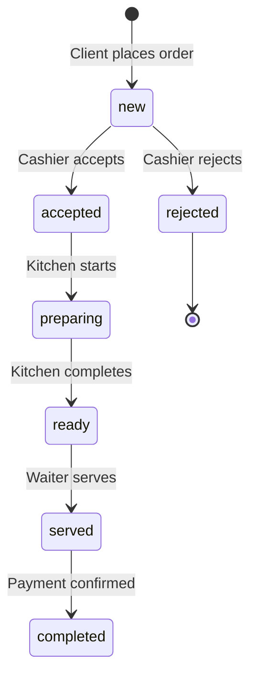
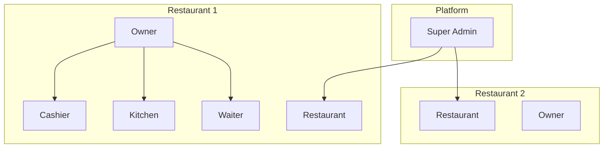

# Tablii Entity-Relationship Diagram

## Order Status Flow

## Multi-Tenant Architecture

## Database Schema (Simplified)

| Table | Description | Key Fields |
|-------|-------------|------------|
| users | Platform owners & admins | id, email, role |
| staff_users | Restaurant staff | id, restaurant_id, role |
| customers | End customers | id, phone |
| restaurants | Restaurant tenants | id, owner_id, slug |
| categories | Menu categories | id, restaurant_id |
| menu_items | Menu items | id, category_id, price |
| customizations | Item options | id, menu_item_id |
| tables_ | Restaurant tables | id, restaurant_id |
| table_sessions | Active sessions | id, table_id |
| orders | Customer orders | id, session_id, status |
| order_items | Order line items | id, order_id, menu_item_id |
| payment_transactions | Flouci payments | id, order_id |
| waiter_calls | Customer requests | id, table_id |
| reviews | Order reviews | id, order_id |
| loyalty_points | Customer loyalty | id, customer_id, restaurant_id |
| notifications | Staff alerts | id, restaurant_id |
| subscriptions | Restaurant plans | id, restaurant_id |
| operating_hours | Weekly schedule | id, restaurant_id |

## Key Features Mapping

| Feature | Implementation |
|--------|---------------|
| Multi-tenant | `restaurant_id` FK on tenant tables |
| Multi-language | `name_fr`, `name_ar`, `name_en` fields |
| Real-time | WebSocket (Flask-SocketIO) |
| Payment | `payment_transactions` table |
| Loyalty | `loyalty_points` table |
| Ramadan | `ramadan_mode` + `ramadan_type` |
| Gift orders | `is_gift`, `gift_from_table` |
| QR codes | `qr_code_url` in `tables_` |
| Subscriptions | `subscriptions` table |
| Operating hours | `operating_hours` table |
