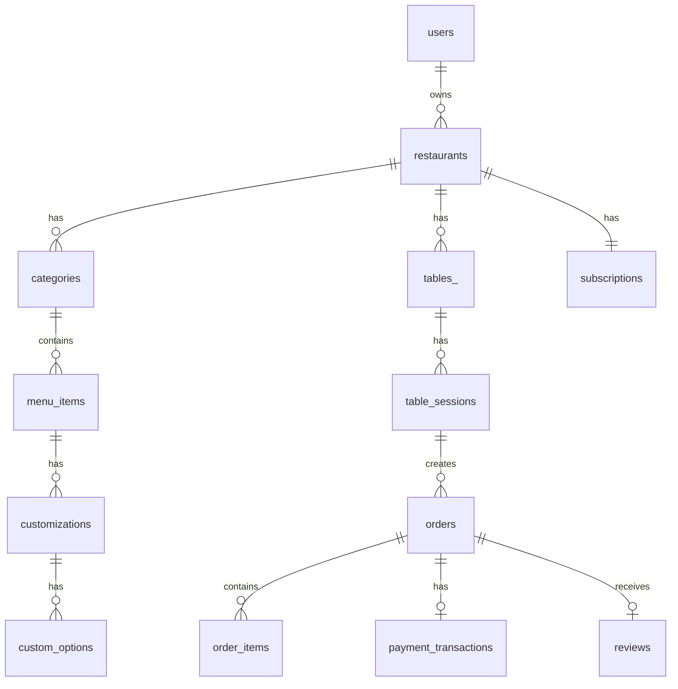

# Phase 12 — Deployment & Documentation

## Context

**Tablii** — Phase 12 of 12 (Final). Configure production deployment on Render.com, finalize documentation, and prepare the project for launch.

---

## Deliverables

```
Procfile                       # (Optional — Render uses Start Command)
render.yaml                    # Render Blueprint (Infrastructure as Code)
docs/
├── API.md                     # API reference documentation
├── DEPLOYMENT.md              # Step-by-step deployment guide
├── USER_MANUAL.md             # End-user guide for restaurant owners
└── DATABASE_SCHEMA.md         # Database schema reference
README.md                     # Update with final info
```

---

## `render.yaml` — Render Blueprint

```yaml
services:
  - type: web
    name: tablii
    runtime: python
    buildCommand: |
      pip install -r requirements.txt
      npm install
      npm run build:css
      flask db upgrade
    startCommand: gunicorn --worker-class eventlet -w 1 --bind 0.0.0.0:$PORT run:app
    envVars:
      - key: FLASK_ENV
        value: production
      - key: SECRET_KEY
        generateValue: true
      - key: DATABASE_URL
        fromDatabase:
          name: tablii-db
          property: connectionString
      - key: PYTHON_VERSION
        value: "3.11"

databases:
  - name: tablii-db
    plan: free
    databaseName: tablii
    user: tablii_user
```

---

## Production Checklist (in `config.py`)

Ensure `ProductionConfig` has:

```python
class ProductionConfig(Config):
    DEBUG = False
    SQLALCHEMY_DATABASE_URI = os.environ['DATABASE_URL']
    # Fix Render's postgres:// → postgresql://
    if SQLALCHEMY_DATABASE_URI.startswith('postgres://'):
        SQLALCHEMY_DATABASE_URI = SQLALCHEMY_DATABASE_URI.replace('postgres://', 'postgresql://', 1)
    SESSION_COOKIE_SECURE = True
    SESSION_COOKIE_HTTPONLY = True
    SESSION_COOKIE_SAMESITE = 'Lax'
    PREFERRED_URL_SCHEME = 'https'
```

---

## Documentation

### `docs/API.md`

Document every API endpoint in a table format:

| Method | Endpoint                      | Auth  | Description      | Request Body        | Response                         |
| ------ | ----------------------------- | ----- | ---------------- | ------------------- | -------------------------------- |
| GET    | `/api/restaurant/<slug>/menu` | None  | Get full menu    | —                   | `{restaurant, categories[]}`     |
| GET    | `/api/menu-item/<id>`         | None  | Get item details | —                   | `{item}`                         |
| GET    | `/api/order/<id>/status`      | None  | Get order status | —                   | `{order_id, status, timestamps}` |
| POST   | `/api/upload-image`           | Login | Upload image     | multipart/form-data | `{url}`                          |

Include example `curl` commands for each endpoint.

### `docs/DEPLOYMENT.md`

Step-by-step guide:

1. Prerequisites (Git, GitHub account, Render account).
2. Push code to GitHub.
3. Create PostgreSQL database on Render.
4. Create Web Service on Render.
5. Configure environment variables.
6. Deploy and verify.
7. Custom domain setup (optional).
8. Troubleshooting common issues.

### `docs/USER_MANUAL.md`

Guide for restaurant owners:

1. Registration and first login.
2. Setting up your restaurant (name, logo, hours).
3. Creating your menu (categories, items, customizations).
4. Setting up tables and printing QR codes.
5. Adding staff members (cashier, kitchen, waiter).
6. Managing orders (cashier workflow).
7. Kitchen display setup.
8. Understanding analytics.
9. Configuring payment settings.
10. Ramadan mode.

### `docs/DATABASE_SCHEMA.md`

List all tables with columns, types, and constraints. Include the ER diagram from the architecture doc as a Mermaid diagram:



---

## Final README.md Update

Update the root `README.md` to include:

- Project description and features list.
- Screenshot placeholders (describe where to add screenshots).
- Quick start for local development.
- Deployment link to `docs/DEPLOYMENT.md`.
- API reference link to `docs/API.md`.
- Tech stack with version numbers.
- License (MIT suggested).
- Contributing guidelines.

---

## Pre-Launch Verification

Run this complete checklist before considering the project done:

### Functionality

- [ ] Register new restaurant owner.
- [ ] Login as owner, cashier, kitchen, waiter.
- [ ] Create categories and menu items with images.
- [ ] Add tables and generate QR codes.
- [ ] Add staff members with correct roles.
- [ ] Scan QR code → see menu on mobile.
- [ ] Add items to cart and place order.
- [ ] Cashier sees new order in real-time.
- [ ] Accept order → kitchen sees it.
- [ ] Kitchen marks ready → waiter/cashier notified.
- [ ] Customer sees live order tracking updates.
- [ ] Call waiter → waiter gets notification.
- [ ] Leave review with rating.
- [ ] Analytics show correct data.

### Security

- [ ] No secrets in code or git history.
- [ ] All POST routes have CSRF protection (except API).
- [ ] Passwords are hashed.
- [ ] Multi-tenant isolation verified.
- [ ] Role-based access enforced.

### Performance

- [ ] Database queries use indexes.
- [ ] Images are lazy-loaded on menu page.
- [ ] Static assets are cached by Service Worker.

### Code Quality

- [ ] All Python code passes `flake8` or `ruff` linting.
- [ ] All tests pass: `pytest tests/`.
- [ ] No hardcoded secrets.
- [ ] All models have docstrings.

---

## Strict Rules

1. Never deploy with `DEBUG = True`.
2. Never expose `SECRET_KEY` or database credentials.
3. Always use `gunicorn` with `eventlet` worker for SocketIO.
4. Always run `flask db upgrade` as part of the build step.
5. Documentation must be accurate — no placeholder text.
6. README must be professional and complete.
